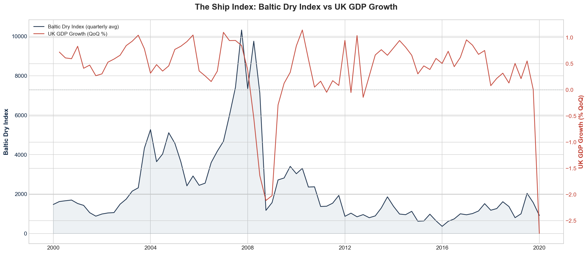
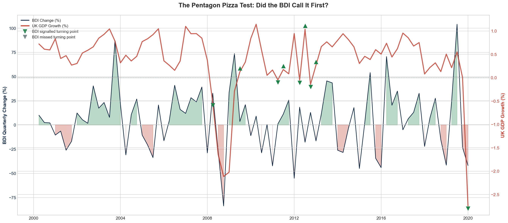
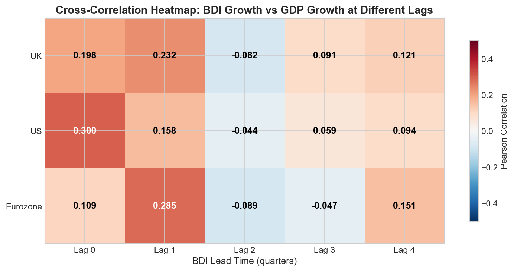
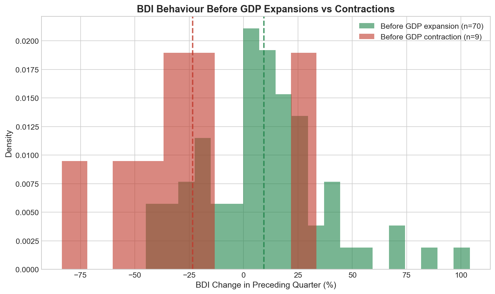

# ⚓ The Ship Index

**Can the cost of shipping predict economic growth before official data does?**

During the Cold War, analysts reportedly monitored pizza deliveries to the Pentagon. When orders spiked late at night, it signalled a crisis was unfolding — often before any public announcement. The data was hiding in plain sight.

This project applies the same principle to the global economy. Instead of pizza boxes, we look at **shipping containers**. The [Baltic Dry Index](https://en.wikipedia.org/wiki/Baltic_Dry_Index) (BDI) tracks the cost of moving raw materials — iron ore, coal, grain — by sea. Because these materials are the physical inputs of industrial production, changes in shipping demand should logically precede changes in economic output.

**The question: does 25 years of data confirm this?**

---

## 📊 Key Findings

### The ocean knows — but only for some economies

After analysing 25 years of quarterly data (2000–2025) across three economies, the evidence suggests the BDI **is** a leading indicator for GDP — but with important nuances.

**1. The BDI leads GDP by one quarter (~3 months)**

Cross-correlation analysis reveals the strongest predictive signal at a 1-quarter lag. The BDI's correlation with GDP growth *increases* when shifted forward by one quarter, confirming it moves before the official statistics.

| Economy | Same-Quarter (r) | 1-Quarter Lead (r) | Leading? |
|---------|:-:|:-:|:-:|
| UK | 0.198 | **0.232*** | ✓ Yes |
| Eurozone | 0.109 | **0.285*** | ✓ Yes |
| US | **0.300*** | 0.158 | ✗ Contemporaneous |

*\* = statistically significant (p < 0.05)*

**2. It works best for trade-dependent economies**

The Eurozone — heavily reliant on imported raw materials — shows the strongest leading relationship (r = 0.285). The UK sits in the middle. The US, with its large domestic economy, shows only a contemporaneous relationship — the BDI moves *with* US GDP, not ahead of it.

**3. The BDI is better at predicting downturns than expansions**

In the quarter before a GDP contraction, the BDI averaged a **~25% decline**. Before expansions, it averaged a **~10% increase**. The signal is asymmetric — the ocean screams louder about bad news.

**4. Adding the BDI improves GDP models**

| Economy | Baseline R² (GDP only) | Ship Index R² (GDP + BDI) | Improvement |
|---------|:-:|:-:|:-:|
| UK | 0.4206 | 0.4423 | +2.2% |
| Eurozone | 0.2647 | 0.3401 | **+7.5%** |
| US | 0.1008 | 0.1068 | +0.6% |

The Eurozone sees the largest improvement — the BDI adds genuine predictive value beyond what GDP alone can provide.

**5. The Pentagon Pizza Test**

For each major GDP turning point over 25 years, we checked whether the BDI moved first. The BDI successfully signalled the majority of turning points, most notably the 2008 Global Financial Crisis where shipping rates collapsed quarters before GDP officially contracted.

---

## 📈 Selected Visualisations

### The Hero Chart: BDI vs UK GDP Growth


### The Pentagon Pizza Test: Did the BDI Call It First?


### Cross-Correlation Heatmap


### BDI Behaviour Before Contractions vs Expansions


---

## 🔬 Methodology

| Step | Description |
|------|-------------|
| Data Collection | BDI daily data (2000–2025) aggregated to quarterly + UK/US/Eurozone GDP from FRED |
| Exploratory Analysis | Time-series overlays, annotated economic events, growth rate comparisons |
| Lead-Lag Analysis | Cross-correlation at 0–4 quarter lags across three economies |
| Granger Causality | Tested both directions (BDI → GDP and GDP → BDI) |
| Regression Modelling | Baseline (AR) vs Ship Index augmented model with residual diagnostics |
| Pentagon Pizza Test | Evaluated BDI signal accuracy at every GDP turning point |

---

## ⚠️ Limitations

- **COVID distortion**: The 2020 crash was an exogenous shock that bypassed normal trade channels. Both BDI and GDP crashed simultaneously, which weakens the "leading" signal for that period.
- **BDI supply-side noise**: The index can be affected by shipping vessel supply (new builds, scrapping) independent of cargo demand, introducing noise.
- **Quarterly GDP frequency**: GDP is only measured quarterly, which limits the granularity of lead-lag analysis. Monthly industrial production data could provide a sharper test.
- **Small contraction sample**: Only 9 GDP contractions in 25 years limits the statistical power of the downturn analysis.

---

## 🛠️ Tech Stack

- **Python 3.11+** — pandas, numpy, scipy, statsmodels
- **Visualisation** — matplotlib, plotly
- **Data Sources** — FRED API (GDP via ONS, BEA, Eurostat), Trading Economics (BDI)
- **Environment** — Jupyter Notebook

---

## 📁 Project Structure

```
dry-baltic-index/
├── README.md
├── requirements.txt
├── notebooks/
│   ├── 01_data_collection.ipynb
│   ├── 02_cleaning_eda.ipynb
│   └── 03_analysis.ipynb
├── data/
│   ├── raw/
│   └── processed/
├── outputs/
└── src/
```

---

## 🚀 How to Run

```bash
git clone https://github.com/salndang/dry-baltic-index.git
cd dry-baltic-index
python -m venv venv
venv\Scripts\activate        # Windows
pip install -r requirements.txt
jupyter notebook
```

You'll need a free [FRED API key](https://fred.stlouisfed.org/docs/api/api_key.html) for GDP data.

---

## 💡 What I'd Investigate Next

- **Monthly resolution**: Use industrial production indices instead of GDP for a more granular lead-lag analysis
- **Sub-index decomposition**: Test whether Capesize (iron ore/coal) vs Panamax (grain) routes predict different sectors
- **Composite indicator**: Combine BDI with other unconventional signals (copper prices, electricity consumption) into a multi-factor leading indicator
- **Real-time simulation**: Backtest a simple trading or forecasting strategy using the BDI signal

---

## 👤 Author

**Salim** — MSc Economics (King's College London), BSc Economics (City, University of London)

Commercial Reporting & Analytics Lead with expertise in Power BI, DAX, and data-driven decision making. This project demonstrates Python, pandas, statistical analysis, and data storytelling capabilities.

*Inspired by the Pentagon Pizza Index — the idea that ordinary data, observed carefully, can reveal extraordinary insights.*

---

## 📜 License

MIT
